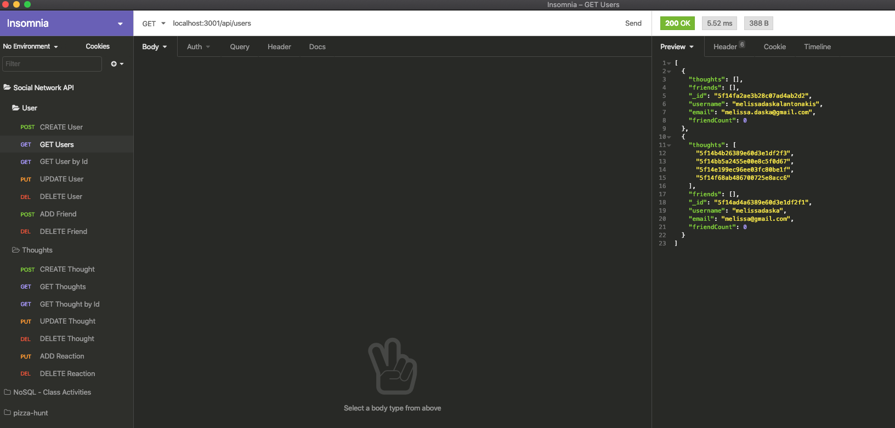
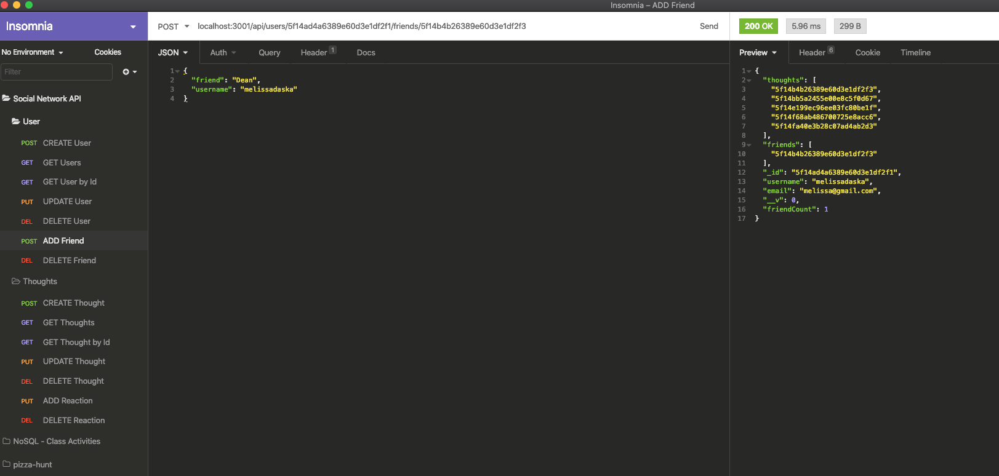
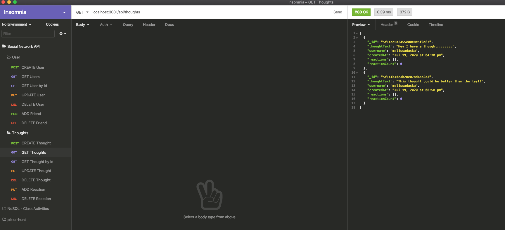
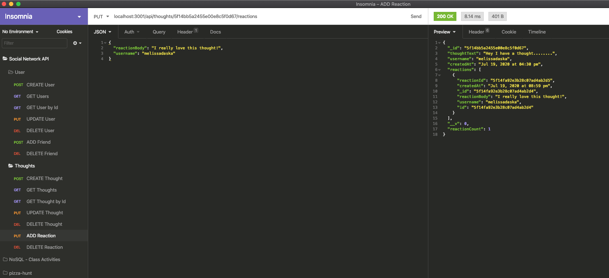

# Social Network API

Follow the links below that demonstrate the functionality of the Social Network API! 
[Demonstration of Models/Controllers/Routes](https://drive.google.com/file/d/183QKOfFfPxhaeVb_h_8MIImzumK02frF/view)
[Invoke Application and Testing User Routes in Insomnia](https://drive.google.com/file/d/10Bux-5VapsxrpcV4SUpgt55NSBUR2G-z/view)
[Testing Thoughts Routes in Insomnia](https://drive.google.com/file/d/1LPPG8fB-h56tIgeDxkFolPLT2emwFqKN/view)

  ## Table of Contents
  
  * [Description](#description)
  * [Screenshots](#screenshots)
  * [Usage](#usage)
  * [Questions](#questions)

## Description

This is great for a social network web application where users can share their thoughts, react to friend's thoughts and create a friend list. It uses Express.js for routing, a MongoDB database, and Mongoose ODM.

## Screenshots
GET Users

Add Friend to User

GET Thoughts

Add Reaction to a Thought

## Usage
Launch terminal, run command npm start, test the routes in Insomnia.

## Questions
If you have any questions, you can reach me by emailing [melissa.daska@gmail.com](mailto:melissa.daska@gmail.com) or follow the link to my gitHub profile [melissadaska](https://github.com/melissadaska).
